# A2M (Application Manage Article)

## Introduction
A2M est une application web Symfony qui permet de gérer des articles provenant de différentes sources (flux RSS, API JSON, fichiers locaux) et de les stocker dans une base de données. Une API REST est également disponible pour accéder aux articles.
## Fonctionnalités
- Récupération d'articles depuis des flux RSS et des API JSON
- Stockage des articles dans une base de données
- Gestion des articles via une API REST
- Authentification JWT pour sécuriser les requêtes
- Mise en cache pour améliorer les performances

## Installation
### Prérequis
- [PHP](https://www.php.net/) 8.1 ou supérieur
- [Composer](https://getcomposer.org/) installé sur votre machine locale.
- [Git](https://git-scm.com/) installé sur votre machine locale.
- [Symfony CLI](https://symfony.com/download) installé sur votre machine locale.
- [API Platform](https://api-platform.com/).

### Pour Commencer

Pour obtenir une copie locale opérationnelle, suivez ces étapes :

1. Cloner le dépôt :

   ```bash
   git clone https://github.com/kabbajkaoutar/A2M.git

2. Naviguer dans le répertoire du projet :

   ```bash
   cd A2M
3. Vérifier les prérequis de Symfony :
    ```bash
   symfony check:requirements
Assurez-vous que tous les prérequis sont satisfaits avant de continuer.

4. Installer les dépendances:
   ```bash
   composer install
5. Créer un fichier .env :
   ```bash
   cp .env.dist .env
6. Générer la clé secrète de l'application:
   ```bash
   php bin/console secrets:generate-keys
7. Configurer votre base de données:
- Mettez à jour le fichier .env avec vos identifiants de base de données.
- Créez la base de données :
  ```bash
  php bin/console doctrine:database:create
- Créez le schéma de la base de données :
  ```bash
  php bin/console doctrine:schema:create

- Chargez les fixtures :
  ```bash
  php bin/console doctrine:fixtures:load

8. Start the Symfony server:
   ```bash
   symfony server:start
#### Remarque
Dans ce projet, la version LTS (Long Term Support) de Symfony 6.1 a été utilisée. Initialement, le plan était de travailler avec la version 7 de Symfony, mais en raison de complications lors de l'installation avec API Platform, la décision a été prise de revenir à Symfony 6.1 LTS.

#### Agrégation d'articles provenant de diverses sources

Accès à l'API via une requête GET

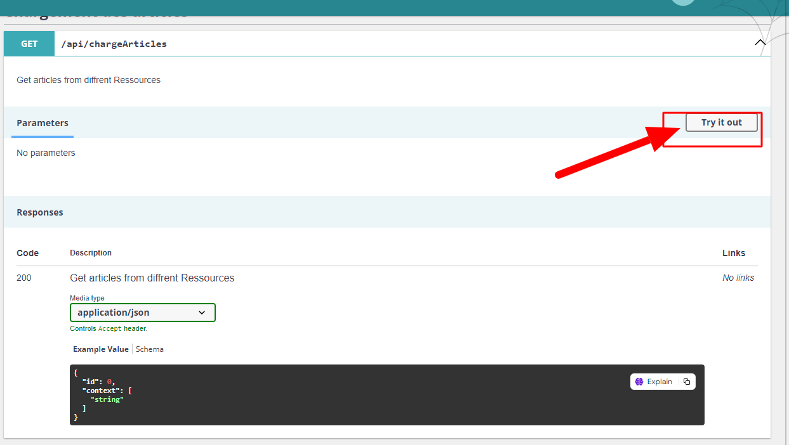

Pour accéder à l'API et charger des articles, envoyez une requête GET à l'URL de l'API. L'API renverra une réponse JSON indiquant que les articles ont été chargés avec succès.

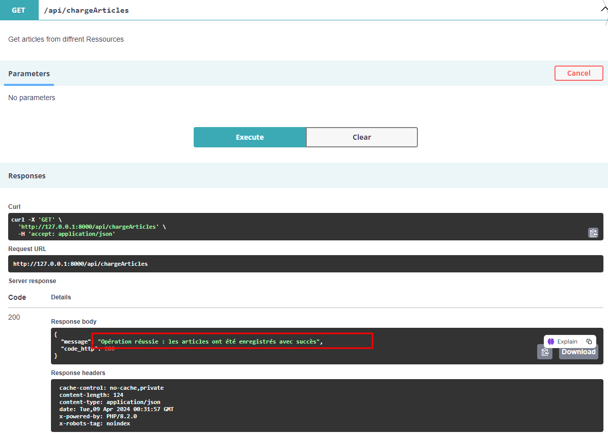

En effet, la méthode `chargeArticles` récupère des articles à partir de diverses sources, les nettoie, les convertit en entités, les enregistre dans la base de données et renvoie une réponse JSON indiquant le statut de l'opération.

#### API REST pour accéder aux articles stockés

Une fois que les articles ont été chargés et stockés dans la base de données, vous pouvez tester l'API en envoyant une requête GET à l'URL suivante :

Vous pouvez accéder à un Datatable qui affiche les articles stockés dans la base de données, vous permettant d'effectuer diverses opérations telles que la recherche par mot-clé et la pagination.

1. Accédez à l'URL http://127.0.0.1:8000/articles

   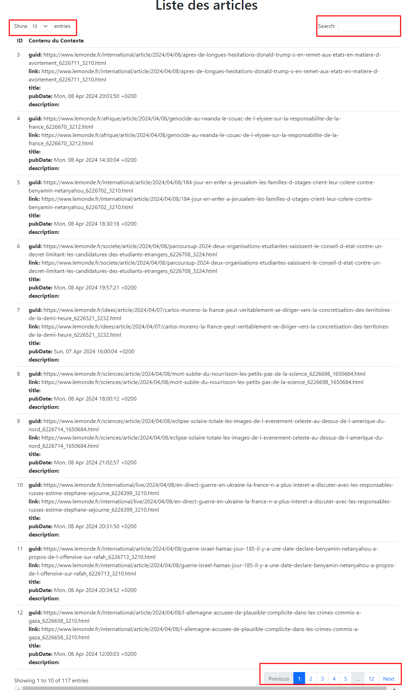

La fonction `listArticles` récupère tous les articles de la base de données et les retourne sous forme d'un tableau de données JSON.

#### Modification, suppression et recherche d'articles via l'API

Vous pouvez effectuer des opérations de modification, suppression et recherche d'articles via l'API REST. J'ai intégré les fonctionnalités CRUD d'API Platform en supprimant certaines requêtes telles que POST et en personnalisant quelques méthodes.

Voici ce que vous pouvez faire :

- **Modification d'un article :** Envoyez une requête PATCH à l'URL de l'article spécifique pour mettre à jour ses détails.

- **Suppression d'un article :** Envoyez une requête DELETE à l'URL de l'article spécifique pour le supprimer de la base de données.

- **Recherche d'articles :** Utilisez la fonction de recherche de l'API REST pour trouver des articles spécifiques.

Par exemple :

- Pour mettre à jour un article, envoyez une requête PATCH à l'URL http://127.0.0.1:8000/articles/{id} avec les nouveaux détails de l'article.

- Pour supprimer un article, envoyez une requête DELETE à l'URL http://127.0.0.1:8000/articles/{id} pour supprimer l'article correspondant.

- Pour rechercher des articles, utilisez les paramètres de requête appropriés dans l'URL de l'API REST pour filtrer les résultats selon vos critères.

Ces fonctionnalités vous permettent de gérer efficacement les articles stockés dans la base de données via l'API REST intégrée.
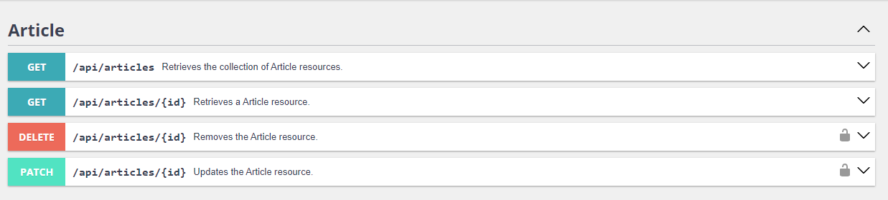

Vous pouvez effectuer des opérations de modification, suppression et recherche d'articles via l'API REST. Pour cela, n'oubliez pas d'ajouter l'annotation `#[ApiResource]` à votre entité `Article` pour la lier à API Platform.

**Ajoutez l'annotation `#[ApiResource]` à votre entité `Article`:**

   ```php
   // src/Entity/Article.php

   namespace App\Entity;

   use ApiPlatform\Core\Annotation\ApiResource;
   use Doctrine\ORM\Mapping as ORM;

   #[ApiResource]
   #[ORM\Entity(repositoryClass: ArticleRepository::class)]
   class Article
   {
       // Vos propriétés et méthodes de classe
   }
L'API REST peut être sécurisée en ajoutant des contrôles d'accès et des autorisations. Par exemple, vous pouvez configurer l'OpenAPI context pour spécifier les exigences de sécurité nécessaires à l'accès à l'API.

**Contrôle de sécurité avec OpenAPI Context :**

   Pour assurer la sécurité de votre API, vous pouvez définir des exigences de sécurité dans l'OpenAPI context. Cela permet de spécifier les méthodes d'authentification nécessaires pour accéder à différentes parties de l'API.

   ```php
   openapiContext: [
       'security' => [['bearerAuth' => []]]
   ],
#### Implémentation de l'authentification

Pour sécuriser l'accès aux données nécessitant une authentification, des jetons Web JSON (JWT) sont utilisés.

- **Authentification**

    - Les utilisateurs peuvent s'authentifier en effectuant une requête POST à la section "Login Check".
     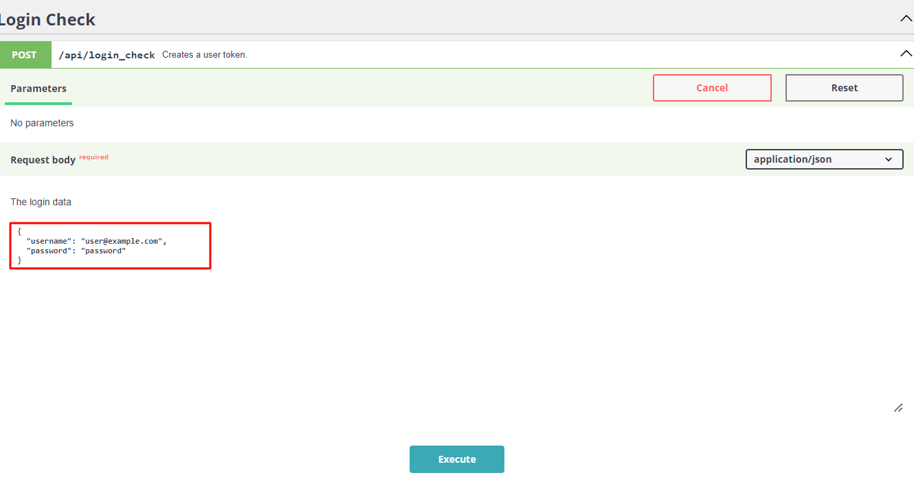
    - Un jeton JWT est renvoyé en réponse.
     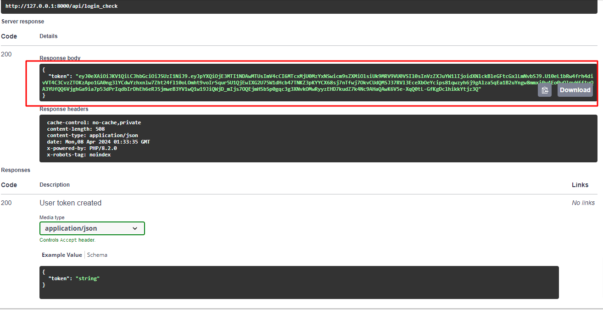
- **Autorisations**
- Les requêtes GET ne nécessitent pas d'authentification.
- Les requêtes PATCH nécessitent une authentification utilisateur.
- Les requêtes DELETE nécessitent une authentification administrateur.

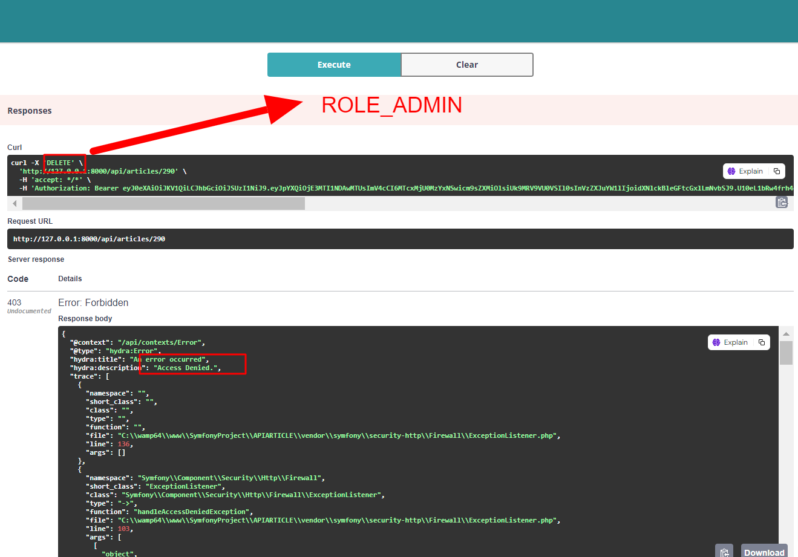

Seules les opérations DELETE et PATCH nécessitent une authentification. Elles sont protégées par le symbole de mot de passe (icône de cadenas) pour indiquer que l'utilisateur ou le client doit fournir des informations d'identification valides pour accéder à ces opérations.
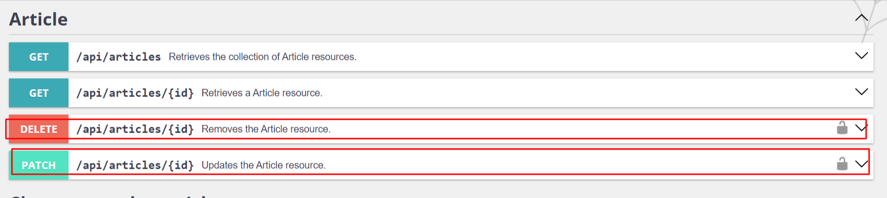

Si l'utilisateur ne fournit pas de jeton Bearer valide, un message d'erreur "Token not found" est renvoyé dans la réponse.

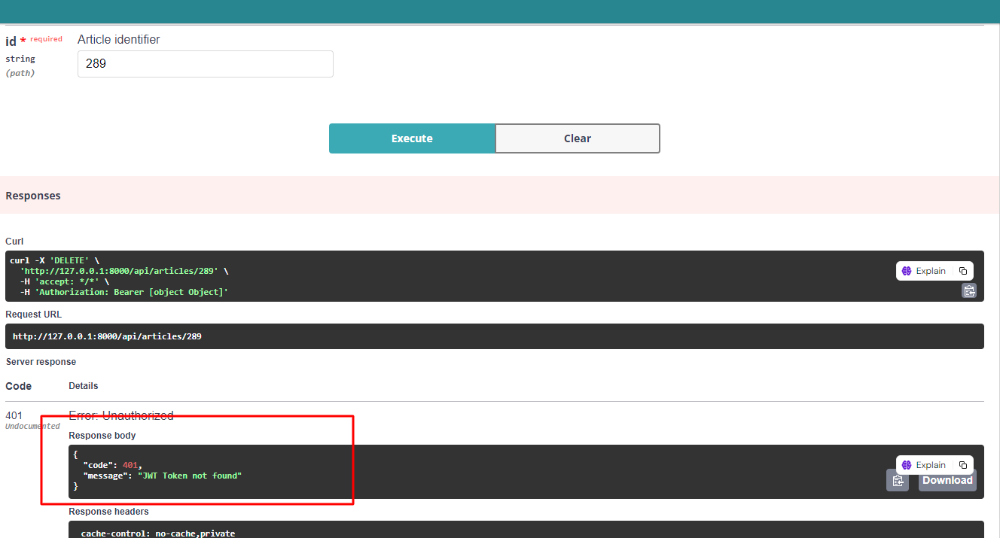

Si un jeton valide est fourni, la requête est autorisée et l'opération est exécutée.

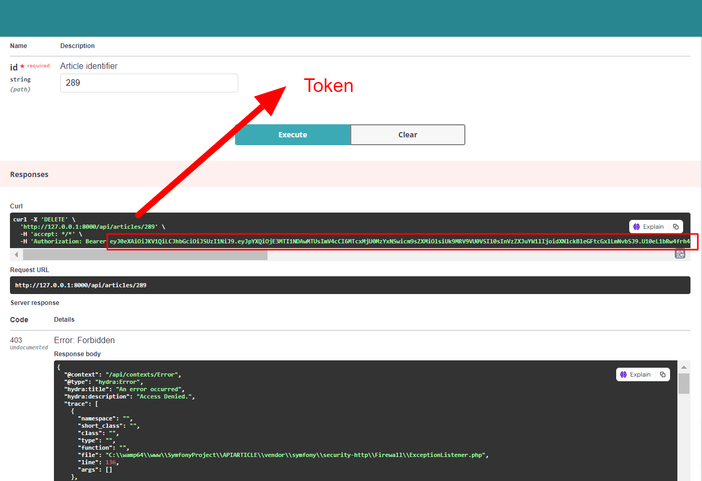
- **Authentification du porteur**

  Le jeton JWT doit être inclus dans l'en-tête de la requête sous la forme `Authorization: Bearer <jeton>`.
  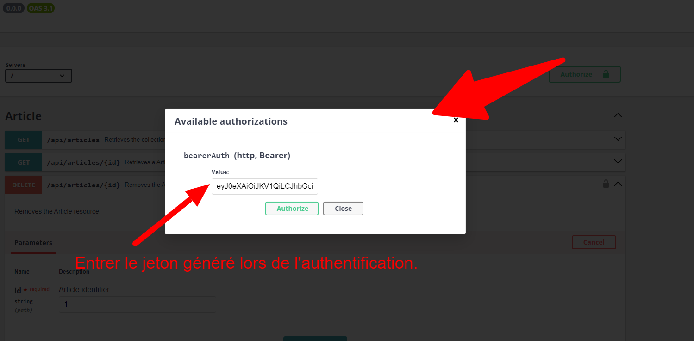
- **Déconnexion**

  Les utilisateurs peuvent se déconnecter en effectuant une requête POST à la section "Logout".
  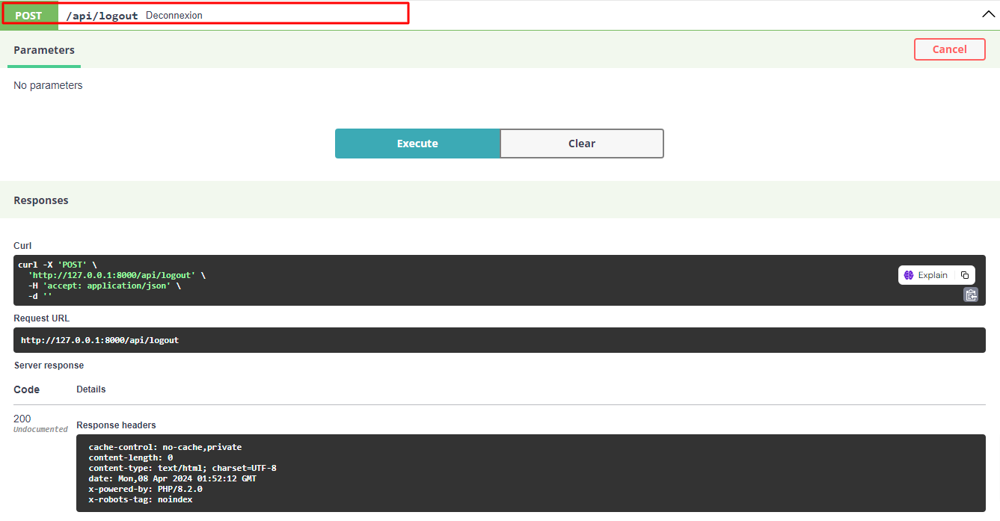


### Note
Pour implémenter JWT, le bundle `lexik/jwt-authentication-bundle` a été utilisé dans Symfony. Assurez-vous que l'extension `ext-sodium` est activée dans votre fichier `php.ini`.

Pour générer les clés requises pour LexikJWTAuthenticationBundle, exécutez :
   ```bash
    php bin/console lexik:jwt:generate-keypair   
  ```
## Configuration du Cache pour API Platform

Afin d'améliorer les performances de mon API et de réduire la charge sur le serveur, j'ai intégré un système de cache pour les entités. Ci-dessous, vous trouverez un exemple de la configuration du cache pour la classe `Article` en utilisant API Platform.

J'utilise l'attribut `ApiCache` pour spécifier les directives de cache HTTP qui seront appliquées aux réponses de l'API pour cette ressource. Cela permet de contrôler le cache au niveau de la réponse HTTP, rendant les données de l'API plus rapidement accessibles par les clients et en diminuant la charge sur le serveur.

### Exemple de Configuration de Cache pour la Classe Article

```php
use ApiPlatform\Core\Annotation\ApiResource;
use ApiPlatform\Core\Annotation\ApiCache;

#[ApiResource]
#[ApiCache(maxAge: 3600, sharedMaxAge: 3600, public: true)]
class Article
{
    // Définition de la classe...
}
```
## Optimisation des Performances avec le Cache Symfony

Pour améliorer les performances de mon application, en particulier pour la gestion efficace de grandes quantités d'articles provenant de différentes sources, j'ai intégré un système de cache grâce au bundle cache de Symfony.

### Utilisation du Cache dans le Service ArticleFetcher

Le service `ArticleFetcher` joue un rôle crucial dans la récupération des articles, que ce soit via RSS ou JSON, depuis des sources distantes. Pour optimiser cette opération, j'ai mis en place un système de cache pour les méthodes `fetchRssArticles` et `fetchJsonArticles`. Voici comment cela fonctionne :

1. **Injection du Cache :** Le cache est injecté dans le service `ArticleFetcher`, ce qui me permet de mettre en cache les résultats des méthodes `fetchRssArticles` et `fetchJsonArticles`. 

2. **Mise en Cache des Résultats :** Lorsque des articles sont récupérés pour la première fois, ils sont mis en cache. Si les mêmes articles sont demandés à nouveau, le système récupère les données directement depuis le cache au lieu de refaire une requête vers la source distante.

3. **Accélération des Appels :** Grâce à cette mise en cache, les appels ultérieurs aux méthodes `fetchRssArticles` et `fetchJsonArticles` sont considérablement accélérés, car les données peuvent être récupérées directement du cache si elles y ont déjà été stockées.

Cela améliore significativement les performances de l'application, surtout lors de la récupération d'articles depuis des sources distantes, en réduisant le temps de réponse et la charge sur le serveur.
En intégrant le système de cache de Symfony dans le service `ArticleFetcher`, j'ai pu optimiser les performances de mon application et offrir une meilleure expérience aux utilisateurs.
