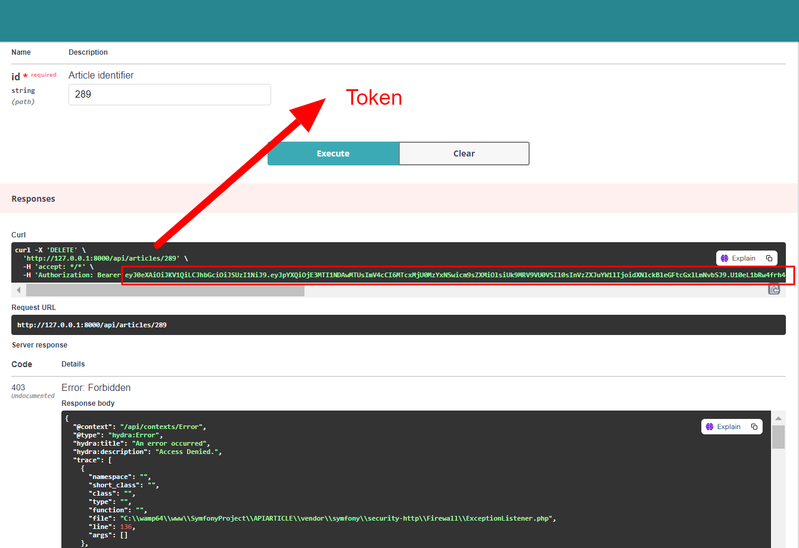

# A2M

## Introduction
A2M (Application Manage Article) est une application Symfony qui gere les articles de différentes sources (API externes, flux RSS, fichiers locaux) puis les stocke en DB. En phase 2, une API REST permet d'y accéder.
## Prérequis
Avant de commencer, assurez-vous d'avoir rencontré les exigences suivantes :

- [PHP](https://www.php.net/) installé sur votre machine locale.
- [Composer](https://getcomposer.org/) installé sur votre machine locale.
- [Git](https://git-scm.com/) installé sur votre machine locale.
- [Symfony CLI](https://symfony.com/download) installé sur votre machine locale.

## Pour Commencer

Pour obtenir une copie locale opérationnelle, suivez ces étapes :

1. Cloner le dépôt :

   ```bash
   git clone https://github.com/kabbajkaoutar/A2M.git

2. Naviguer dans le répertoire du projet :

   ```bash
   cd A2M
3. Vérifier les prérequis de Symfony :
    ```bash
   symfony check:requirements
Assurez-vous que tous les prérequis sont satisfaits avant de continuer.

4. Installer les dépendances:
   ```bash
   composer install
5. Créer un fichier .env :
   ```bash
   cp .env.dist .env
6. Générer la clé secrète de l'application:
   ```bash
   php bin/console secrets:generate-keys
7. Configurer votre base de données:
- Mettez à jour le fichier .env avec vos identifiants de base de données.
- Créez la base de données :
  ```bash
  php bin/console doctrine:database:create
- Créez le schéma de la base de données :
  ```bash
  php bin/console doctrine:schema:create

- Chargez les fixtures :
  ```bash
  php bin/console doctrine:fixtures:load

8. Start the Symfony server:
   ```bash
   symfony server:start
## Remarque
Dans ce projet, la version LTS (Long Term Support) de Symfony 6.1 a été utilisée. Initialement, le plan était de travailler avec la version 7 de Symfony, mais en raison de complications lors de l'installation avec API Platform, la décision a été prise de revenir à Symfony 6.1 LTS.

### Implémentation de l'authentification pour les sources de données requérant une authentification.
Pour sécuriser l'accès aux données nécessitant une authentification, des jetons Web JSON (JWT) ont été mis en œuvre. Lorsqu'un utilisateur se connecte, un jeton encodé contenant ses informations est généré.

Un système d'authentification a été établi pour les requêtes GET et PATCH. Cependant, pour les requêtes DELETE, seuls les administrateurs sont autorisés à les effectuer. Pour les requêtes PATCH, seuls les utilisateurs connectés sont autorisés à les exécuter, comme illustré dans le schéma ci-dessous :

Pour vous authentifier, il vous suffit d'effectuer une requête POST dans la section "Login Check", comme illustré dans le schéma ci-dessous :

[Schéma illustrant la section "Vérification de la connexion"]


Une fois la requête exécutée, si vos identifiants sont valides, un jeton vous sera renvoyé en réponse. 

Ce jeton contient les détails de votre nom d'utilisateur et de votre rôle. Il sera utilisé pour l'authentification du porteur.
L'authentification du porteur est une méthode d'authentification qui utilise un jeton pour identifier un utilisateur. Le jeton est généralement envoyé dans l'en-tête de la requête HTTP sous la forme "Authorization: Bearer <jeton>".
Une fois authentifié, vous aurez le droit d'effectuer les requêtes qui nécessitent une autorisation, telles que les requêtes DELETE et PATCH.

N'oubliez pas d'inclure le jeton d'authentification dans l'en-tête de la requête avant d'exécuter les requêtes DELETE et PATCH. Si vous ne le faites pas, vous recevrez une réponse d'erreur indiquant que le jeton est invalide
Si un jeton d'authentification valide est fourni, les requêtes nécessitant des droits d'accès seront exécutées avec succès.

Attention seulement l'admin qui a le droit d'executer la requête DELETE 

### Deconnexion
Le jeton d'authentification est utilisé pour identifier un utilisateur authentifié. Lorsque vous vous déconnectez, le serveur invalide le jeton et supprime toutes les informations d'état associées à votre session.
si vous lancer encore une fois la requete delete par exemple vous apercevrez que le Beerer a ete vider 


### Note
Pour implémenter JWT, le bundle `lexik/jwt-authentication-bundle` a été utilisé dans Symfony. Assurez-vous que l'extension `ext-sodium` est activée dans votre fichier `php.ini`.

Pour générer les clés requises pour LexikJWTAuthenticationBundle, exécutez :
   ```bash
    php bin/console lexik:jwt:generate-keypair   
  ```
## Configuration du Cache pour API Platform

Afin d'améliorer les performances de mon API et de réduire la charge sur le serveur, j'ai intégré un système de cache pour les entités. Ci-dessous, vous trouverez un exemple de la configuration du cache pour la classe `Article` en utilisant API Platform.

J'utilise l'attribut `ApiCache` pour spécifier les directives de cache HTTP qui seront appliquées aux réponses de l'API pour cette ressource. Cela permet de contrôler le cache au niveau de la réponse HTTP, rendant les données de l'API plus rapidement accessibles par les clients et en diminuant la charge sur le serveur.

### Exemple de Configuration de Cache pour la Classe Article

```php
use ApiPlatform\Core\Annotation\ApiResource;
use ApiPlatform\Core\Annotation\ApiCache;

#[ApiResource]
#[ApiCache(maxAge: 3600, sharedMaxAge: 3600, public: true)]
class Article
{
    // Définition de la classe...
}
```
## Optimisation des Performances avec le Cache Symfony

Pour améliorer les performances de mon application, en particulier pour la gestion efficace de grandes quantités d'articles provenant de différentes sources, j'ai intégré un système de cache grâce au bundle cache de Symfony.

### Utilisation du Cache dans le Service ArticleFetcher

Le service `ArticleFetcher` joue un rôle crucial dans la récupération des articles, que ce soit via RSS ou JSON, depuis des sources distantes. Pour optimiser cette opération, j'ai mis en place un système de cache pour les méthodes `fetchRssArticles` et `fetchJsonArticles`. Voici comment cela fonctionne :

1. **Injection du Cache :** Le cache est injecté dans le service `ArticleFetcher`, ce qui me permet de mettre en cache les résultats des méthodes `fetchRssArticles` et `fetchJsonArticles`. 

2. **Mise en Cache des Résultats :** Lorsque des articles sont récupérés pour la première fois, ils sont mis en cache. Si les mêmes articles sont demandés à nouveau, le système récupère les données directement depuis le cache au lieu de refaire une requête vers la source distante.

3. **Accélération des Appels :** Grâce à cette mise en cache, les appels ultérieurs aux méthodes `fetchRssArticles` et `fetchJsonArticles` sont considérablement accélérés, car les données peuvent être récupérées directement du cache si elles y ont déjà été stockées.

Cela améliore significativement les performances de l'application, surtout lors de la récupération d'articles depuis des sources distantes, en réduisant le temps de réponse et la charge sur le serveur.
En intégrant le système de cache de Symfony dans le service `ArticleFetcher`, j'ai pu optimiser les performances de mon application et offrir une meilleure expérience aux utilisateurs.
